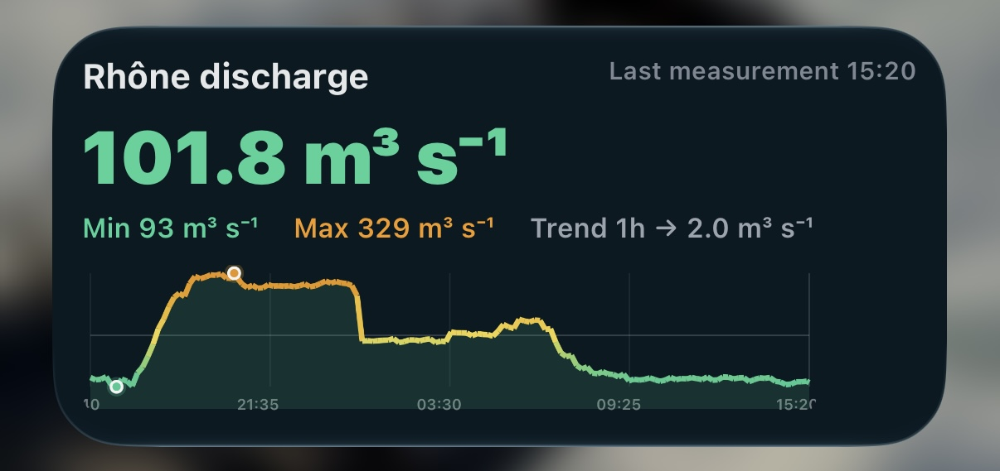

# Hydrodata Widget

A [Scriptable](https://scriptable.app) widget for iOS that shows live river discharge readings from the Swiss Federal Office for the Environment's [hydrodaten.admin.ch](https://www.hydrodaten.admin.ch) API — current value, a 24h trend, min/max, and a severity-tinted chart that colors itself using each station's own official flood-stage bands. Falls back to a cached reading when the network is down, and can drive any station on the network from a single script.

## Screenshots

## Requirements

- iOS with the free [Scriptable](https://apps.apple.com/app/scriptable/id1405459188) app installed.

## Installation

1. Open Scriptable and create a new script.
2. Paste in the contents of [`widget.js`](widget.js).
3. Give the script a name (e.g. "Hydrodata").
4. Long-press your Home Screen → add a widget → choose **Scriptable** → pick your script and the **Medium** size.

## Usage

### Default station

The widget ships pointed at the Rhône at Geneva (station `2606`). Edit `CONFIG.stationId` and `CONFIG.riverName` in the script to change the default station, or tune `CONFIG.thresholds` / `CONFIG.referenceValue` to match that station's own flow.

### Multiple stations (widget parameter)

To run several widgets — each for a different river — off the *same* script: long-press a widget → **Edit Widget** → set **Parameter** to another station ID (e.g. `2019`). That instance will:

- fetch and cache that station's data independently,
- auto-detect its display name and official flood-stage thresholds from the API response (no need to hand-tune `CONFIG` per station),
- leave your default station's widget and hand-tuned config untouched.

Find a station ID from its URL on [hydrodaten.admin.ch](https://www.hydrodaten.admin.ch) — e.g. `.../stations/2019` → parameter `2019`.

### Widget size

Only the **Medium** Home Screen widget is supported for now — layout, fonts, and chart dimensions are all fixed to that size. Small, Large, and Lock Screen/StandBy aren't handled specially; they'll still render (using the Medium layout squeezed into whatever frame iOS gives them) but aren't a supported target yet.

Tapping the widget opens the station's page on hydrodaten.admin.ch.

### Threshold alerts

Configured under `CONFIG.alerts`:

| Field | Meaning |
| --- | --- |
| `enabled` | Turn notifications on/off entirely. |
| `highThreshold` | Notify at/above this value (m³/s). `null` defaults to the station's "extreme" flood-stage band. |
| `lowThreshold` | Notify at/below this value (m³/s). `null` disables low-side alerts — there's no official "too low" threshold, so pick a number that matters for what you use the river for. |
| `cooldownHours` | Minimum gap between repeat notifications for the same ongoing alert. |

You'll also get a "back to normal" notification once the reading clears the alert range. First run may prompt iOS for notification permission for Scriptable — accept it, or alerts won't be delivered.

## Configuration reference

All settings live in `CONFIG` at the top of the script:

| Field | Meaning |
| --- | --- |
| `stationId` | Default hydrodaten.admin.ch station ID. |
| `riverName` | Display name for the default station. |
| `bgFile` | Cached background image filename. |
| `hoursWindow` | How much history the chart/stats window covers. |
| `trendHours` | Lookback window for the trend arrow. |
| `trendStablePercent` | Fraction of change below which the trend reads "stable". |
| `referenceValue` | Value the chart's horizontal reference line marks (default station only). |
| `thresholds.low/high/extreme` | Color-gradient thresholds (default station only). |
| `alerts` | See [Threshold alerts](#threshold-alerts) above. |

## Limitations

- **Only the Medium widget size is supported for now.** Small, Large, and Lock Screen/StandBy aren't laid out for their own dimensions.
- **Apple Watch Smart Stack isn't supported.** That requires a native watchOS app with its own WidgetKit extension, built and shipped via Xcode — Scriptable has no companion watch app, so there's no way to get a Scriptable script onto the watch.
- Data and thresholds come entirely from the public hydrodaten.admin.ch API; if a station's response shape changes, parsing may need updating.
